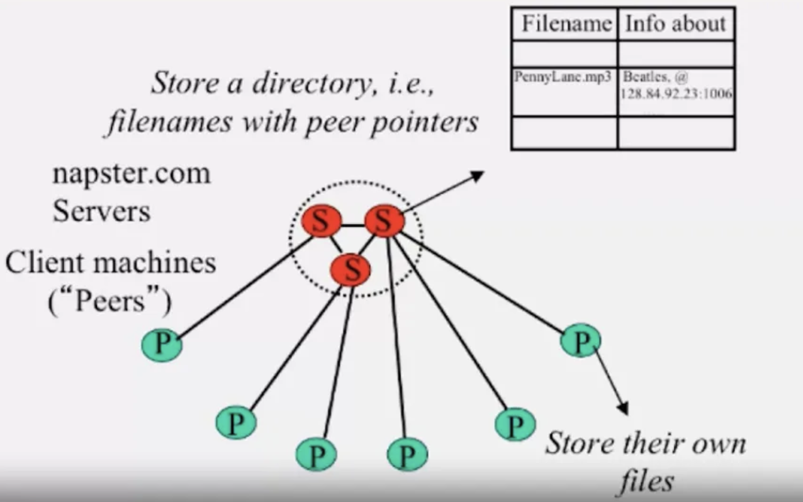

#### Architecture of Napster

 - Server runs directory service which stored <file name, ip_address, port number>. 
 - Servers store tuples, not files.

When a peer wants to fetch a file by using Napster:

The client in the network enters a keyword -> The query will be sent to the connected server for finding relevant information.
The servers in the network check for the relevant keyword and they communicate with each other and will send the list of relevant information to the connected peer as a response.

The servers stores the directory information in the ternary tree (a sorted dictionary data structure)structure.

3. The list will be sent to the querying peer with all attributes like file name, file size, frequency, length, user, connection and also ping.

4. As soon as the querying peer gets the list, the peer selects the best host out of the list, pings it and download the file from the host.

All the messages will be transferred under the TCP socket and use the TCP protocol.

Drawbacks:

- Centralizes server a source of congestion 
- single point of failure
- No Security  --plaintext passwords
- Copyright violation